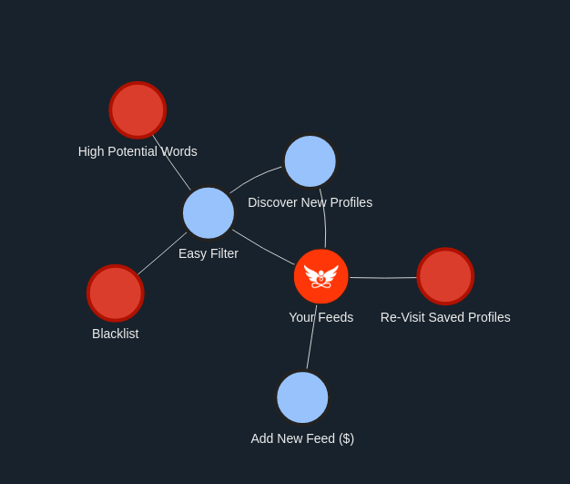

# simple-stable-data


Simple JavaScript VisJS Network Visualizer Starter

## Install
```
git clone https://github.com/neil-yoga/simple-stable-data
mv simple-stable-data [your www-directory]
# browse 
```

## Create Your Own
Edit values in ./index.html between /* SUPERSCRIPT */

### Simple Functions
```
addGoodNode("Add New Feed ($)"); // add good node
addBadNode('High Potential Words'); // add red node
addEdge('Easy Filter','High Potential Words'); // add single line
addEdge("Discover New Profiles",["Your Feeds","Easy Filter"]); // add multiple lines
```


### Bonus: Keep things alive
```
// Enjoy the free code sharing. 
//
// ☯️ If you used my code to save time,
//  consider donating eco-friendly crypto:
```

```
nano_3boxqk5q56xsz8ufrw9srrz4pta6ffbkrg9j31aqziz8wtnr6j68ci7s4cnc
```

```
// It matters: Everything is an energy exchange ⚡.
//
//
// ^ Also feel free to copy this template for your own projects and replace the wallets.
// 🙏 You deserve to be happy and free.
```

### Nano?
<a style="color:black;font-size:15px;" href="https://nano.org">Zero Fees, Eco-Friendly, Instant Payments</a>

